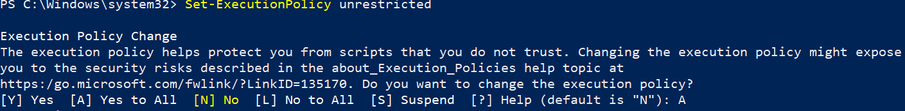
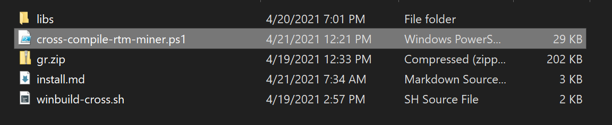
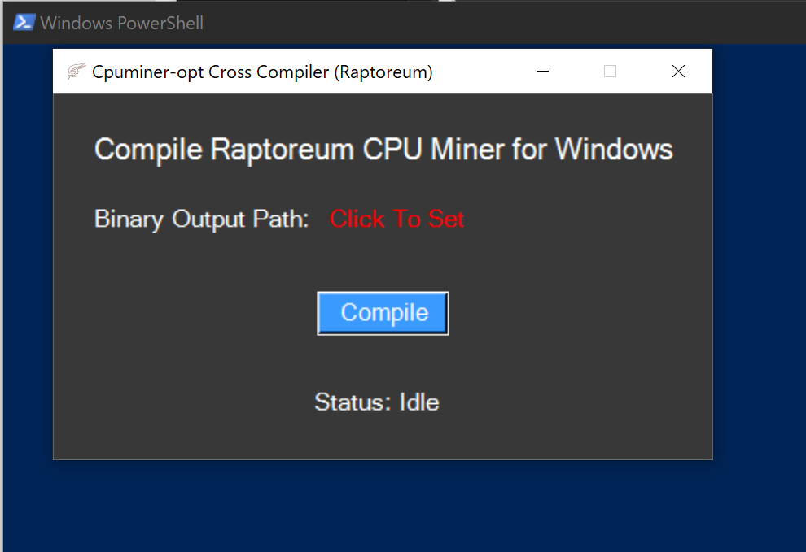
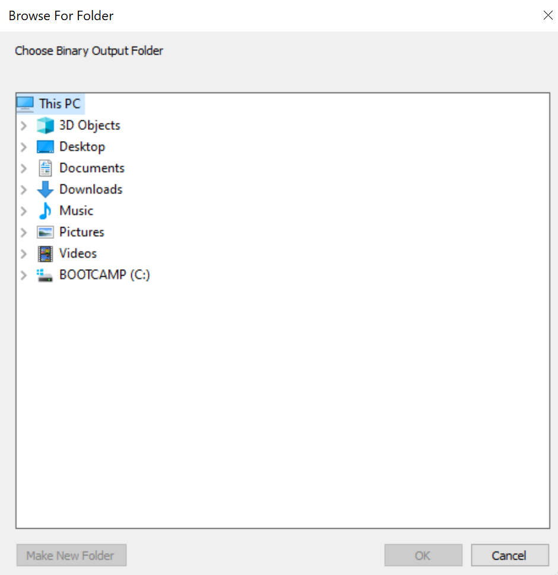
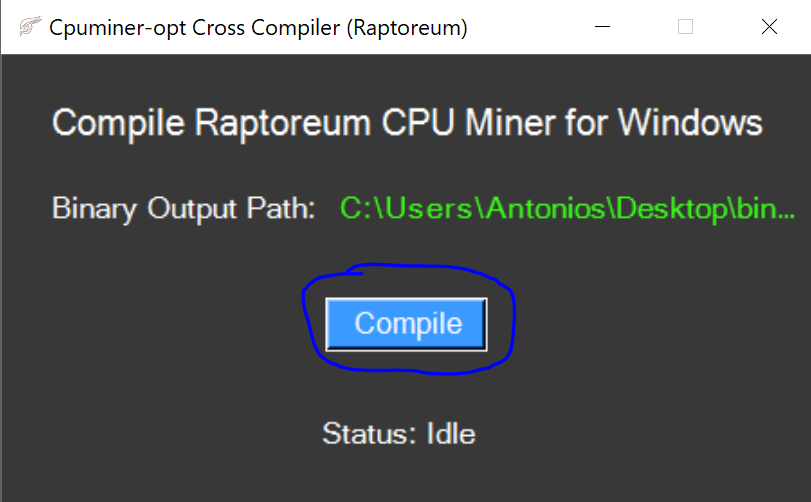
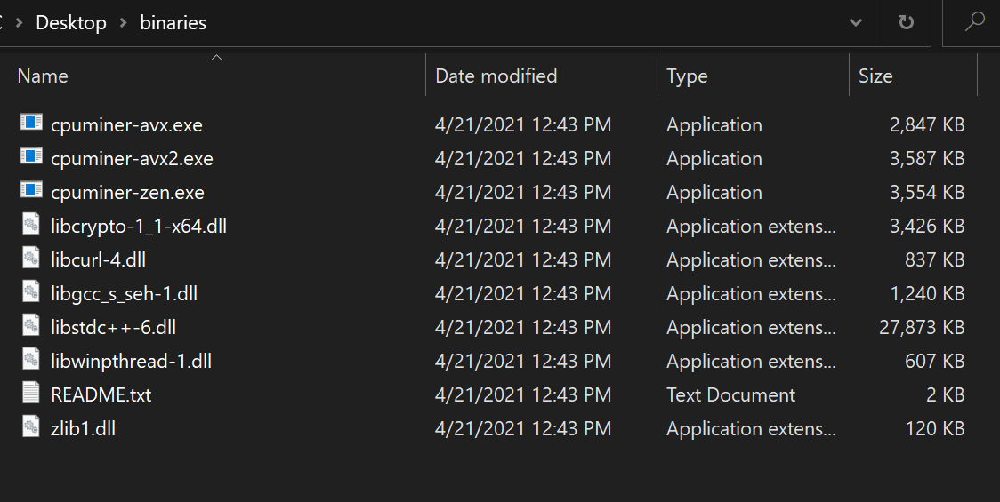

import ReactPlayer from 'react-player'

# Cross-compiling

## Video Guide

<sub>Video Guide - credit @Revvz</sub>
<ReactPlayer playing controls url='https://www.youtube.com/watch?v=RFmkqNmDS9I' muted={true} playing={false} />

## Cross-compiling Guide

:::note

This guide will show you how to automatically cross compile EXE files for the Yerbas CPU miner through a tool that utilizes Ubuntu and WSL.

:::

The full offline guide as well as files needed for this guide are here: Cross Compile Files

### Requirements

:::info

This guide assumes that you have Ubuntu 20.04 installed and running under WSL 2. If you don't have WSL 2 and/or Ubuntu 20.04 installed, please install it.

:::

- Enough computing resources and available instruction sets to compile the CPU miner (varies by system)
- PowerShell Script Execution Policy must be set to Unrestricted. Do it using the following (must run PowerShell as Administrator): `Set-ExecutionPolicy unrestricted`. To revert this change after you finished cross compiling the CPU miner, run `Set-ExecutionPolicy restricted`



### Installation

:::note

Before installing dependencies, it is highly recommended to update the package list and upgrade Ubuntu. This can be done using the following:

:::

```bash
sudo apt update && sudo apt upgrade
```

Due to PowerShell not having access to the `sudo` command that is present in Ubuntu 20.04, you will have to install some dependencies using `apt`. This can simply be done using the following:

```bash
sudo apt install mingw-w64 libz-mingw-w64-dev build-essential automake libssl-dev libcurl4-openssl-dev libjansson-dev libgmp-dev zlib1g-dev git unzip
```

### Compilation

1. Open cross-compile-yerb-miner.ps1 by right clicking on the file and selecting `Run With PowerShell`. A GUI will pop up. This GUI gives you access to everything you need to cross compile the Yerbas CPU miner (based on `cpuminer-opt`)





2. Select the output directory of the miner EXEs and the extra libraries by cliking on Click To Set. A File Explorer window will pop up asking you to pick a folder.




3. After the ouput directory has been set, you may click `Compile`. This may take a while, so please pe patient. The whole process is automated, so when the compilation is complete, a popup window will show letting you know that compilation is complete. The CPU miner EXEs will be found in the output directory you choose, assuming that is was accessible after compilation. The GUI will freeze, but you will be able to see the step it's on (Indicated by its Status) and the output of the process in the PowerShell window that opened the GUI. If you encounter any errors, please let us know!



### Addtional Cleanup

:::note

While the Cross Compiler does clean up the things that it can, such as the library files that are no longer needed in WSL, there are other things that require manual intervention due to file and command permissions. The following steps are optional, but highly recommended.

:::

1. Launch Ubuntu 20.04
2. To remove the unnecessary source repository, run sudo rm -r cpuminer-gr-avx2. It will ask you for your user password. Enter that when prompted.
3. To remove the packages that were used during the build (and are no longer necessary), run:

```bash
sudo apt remove mingw-w64 libz-mingw-w64-dev build-essential automake libssl-dev libcurl4-openssl-dev libjansson-dev libgmp-dev zlib1g-dev git unzip
sudo apt autoremove
```

### Accessing CPU Miner Binaries

The compiled EXEs (along with the required DLLs and a README) will be found in the output directory that you choose in the GUI before clicking the Compile button.



Happy Mining! 🎉